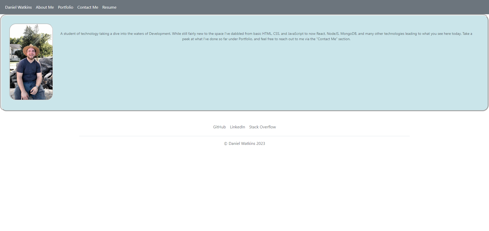

# react-portfolio

## react-portfolio

## Description

Link: https://dan-watkins-react-portfolio.netlify.app/

This is my personal Development Portfolio site. As I continue learning and creating applications this site will be updated to include my latest work, as well as ways to contact me should you want to reach out. The current version utilizes my latest understanding of React.

## Table of Contents

- [Installation](#installation)
- [Usage](#usage)
- [Contribution](#contribution)
- [Tests](#tests)
- [License](#license)
- [Questions](#questions)

## Installation

Simply clone the repository. The current project is deployed using Netlify, so feel free to use that or another hosting provider for your own project.

## Usage

N/A

## Contribution

N/A

## Tests

N/A

## License

N/A

## Questions

You can reach me at danielwatkins@byu.net or find me at https://github.com/dan-watkins
